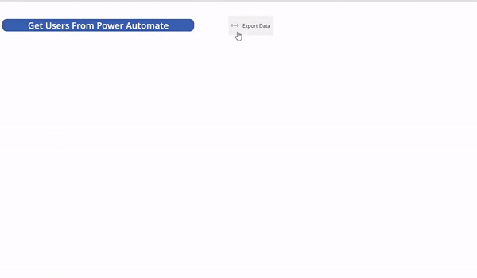

# fluent-ui-json-export-pcf

This control is a export control for canvas apps. It is built using the [Fluent UI](https://developer.microsoft.com/en-us/fluentui#/) framework for React. It takes a JSON array as an input and provides the ability to user to export the JSON array as one of the formats mentioned below
1. Excel
2. CSV
3. PDF
4. XML

## Control Preview

## Install 
1. Download the latest version from the [releases](https://github.com/codidharma/fluent-ui-json-export-pcf/releases).
2. Import the managed solution into your power platform environment.

## Component Configuration Guide

Following short video provided shows how to configure and use the component.

https://user-images.githubusercontent.com/113417221/205482093-b8d7d836-1fc2-495c-b8ff-68a959f7d236.mp4

Read more about it on my blog [Virtual PCF Component to Export Json Table(Array) Data in Canvas Apps](https://codidharma.com/posts/json-table-export-pcf/)

